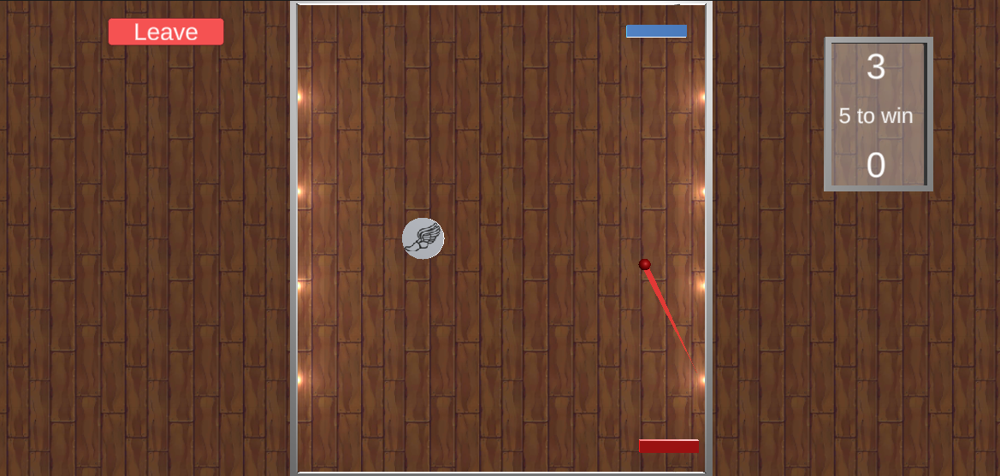
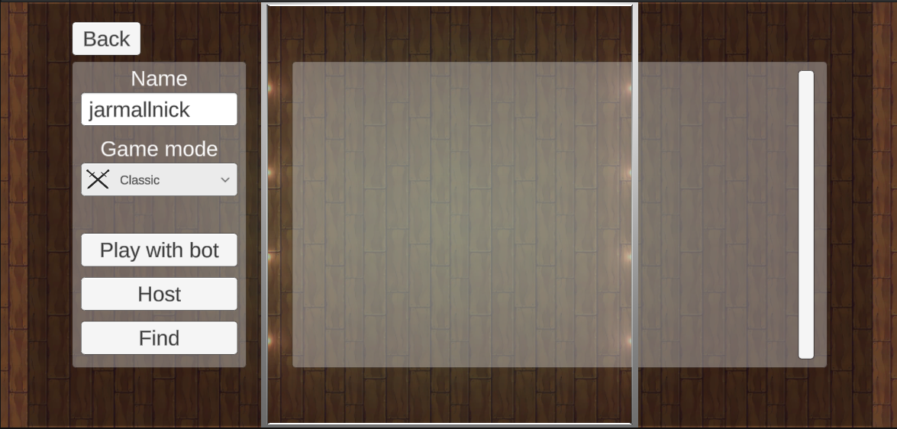

# The Pong game

Simple ping-pong game, made for mobile. Currently on GooglePlay inner testing, about to be published.

## Features

- Singleplayer with bot. Player's and bot's speed depends on selected difficulty.
- Lan multiplayer. Two players can connect with each other inside the same wi-fi connection and play together. 
- Two game modes.
    - Classic. The goal is to touch a wall behind the opponent's platform.
    - Accuracy. The goal is to catch a target, generated on a table.
- Powerups, that can haste the ball, or show a trajectory.

### Gameplay

### Lobby

